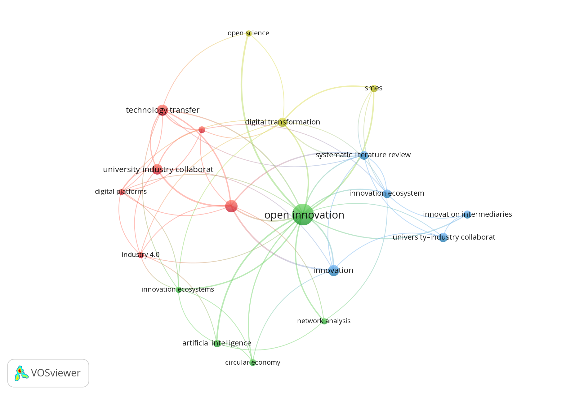
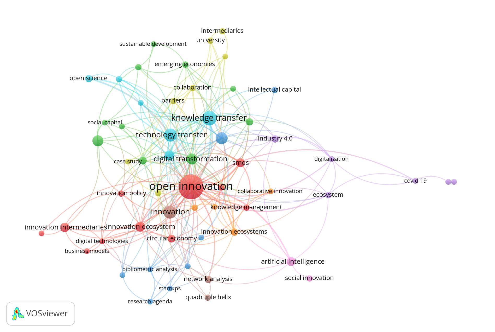
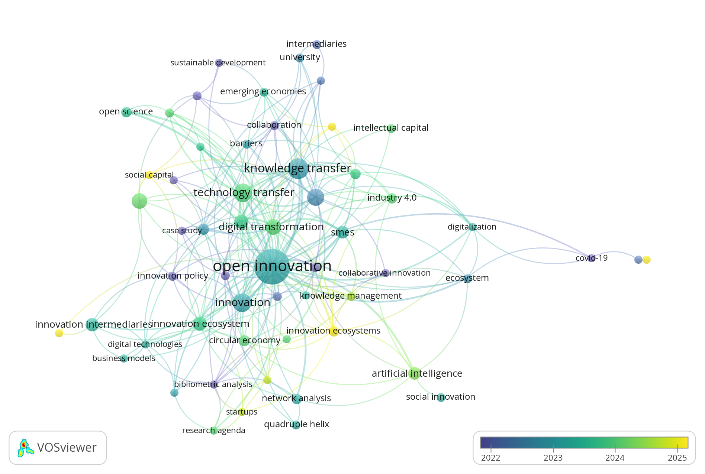

# Visualizaciones Bibliométricas con VOSviewer

Este directorio contiene las visualizaciones bibliométricas generadas a partir del conjunto de datos unificado y desduplicado ([sources/unified_citations.ris](../sources/unified_citations.ris)) de cientas de publicaciones científicas indexadas.

---

## 1. Red de Co-ocurrencia de Palabras Clave (Umbral: Mínimo 5 Ocurrencias)

### Características
* **Archivo de imagen:** [`co_ocurrence_5min.png`](./co_ocurrence_5min.png)
* **Tipo de análisis:** Co-ocurrencia (*Co-occurrence*)
* **Unidad de análisis:** Palabras clave (*Keywords / All keywords*)
* **Método de conteo:** *Full counting*
* **Umbral de inclusión:** Mínimo **5 ocurrencias** por palabra clave
* **Vista:** *Network Visualization* (Estructura de clusters por colores)

### Interpretación y Utilidad para el Artículo
* Muestra el **núcleo consolidado y de mayor frecuencia** en la literatura de intermediación y colaboración universidad-empresa.
* Filtra términos periféricos o infrecuentes para concentrarse en las relaciones cardinales: *Open Innovation*, *University-Industry Collaboration*, *Technology Transfer*, *Innovation Intermediaries* y *Digital Transformation*.
* **Recomendada para:** Resumir de manera limpia y legible en una sola columna del artículo la estructura central de la literatura.

---

## 2. Red de Co-ocurrencia de Palabras Clave (Umbral: Mínimo 3 Ocurrencias)

### Características
* **Archivo de imagen:** [`co_ocurrence_3_min.png`](./co_ocurrence_3_min.png)
* **Tipo de análisis:** Co-ocurrencia (*Co-occurrence*)
* **Unidad de análisis:** Palabras clave (*Keywords / All keywords*)
* **Método de conteo:** *Full counting*
* **Umbral de inclusión:** Mínimo **3 ocurrencias** por palabra clave
* **Vista:** *Network Visualization* (Estructura granular de clusters)

### Interpretación y Utilidad para el Artículo
* Proporciona un **mapa temático ampliado y detallado**, capturando conceptos complementarios y subdisciplinas emergentes (como *SMEs*, *Dynamic Capabilities*, *Entrepreneurial Ecosystems*, *Absorptive Capacity* y *Knowledge Management*).
* Permite observar puentes conceptuales e interconexiones que conectan la gestión de proyectos de innovación con las capacidades formativas y organizacionales.
* **Recomendada para:** Un análisis exhaustivo del estado del arte o figura de ancho completo (dos columnas) que detalle las distintas líneas de investigación.

---

## 3. Evolución Temporal de Palabras Clave (Overlay Visualization - Mínimo 3 Ocurrencias)

### Características
* **Archivo de imagen:** [`co_ocurrence_overlay_3_min.png`](./co_ocurrence_overlay_3_min.png)
* **Tipo de análisis:** Co-ocurrencia con gradiente temporal (*Overlay Visualization*)
* **Unidad de análisis:** Palabras clave (*Keywords / All keywords*)
* **Método de conteo:** *Full counting*
* **Umbral de inclusión:** Mínimo **3 ocurrencias**
* **Escala temporal:** Gradiente cromático según el año medio de publicación de los artículos asociados (de azul/morado para los años iniciales a verde y amarillo brillante para 2024–2026).

### Interpretación y Utilidad para el Artículo
* Evidencia la **frontera del conocimiento y las tendencias recientes**:
  * **Nodos tradicionales (azul/morado):** Conceptos clásicos de transferencia tecnológica, parques científicos e intermediación física tradicional.
  * **Nodos emergentes y vigentes (amarillo/verde claro):** Ecosistemas de innovación digital, plataformas de intermediación multilateral, transformación digital, sostenibilidad y capacidades dinámicas en colaboración universidad-empresa.
* **Recomendada para:** Justificar en la *Introducción* o *Discusión* la pertinencia y novedad de diseñar artefactos e intermediación digital en la formación ingenieril.